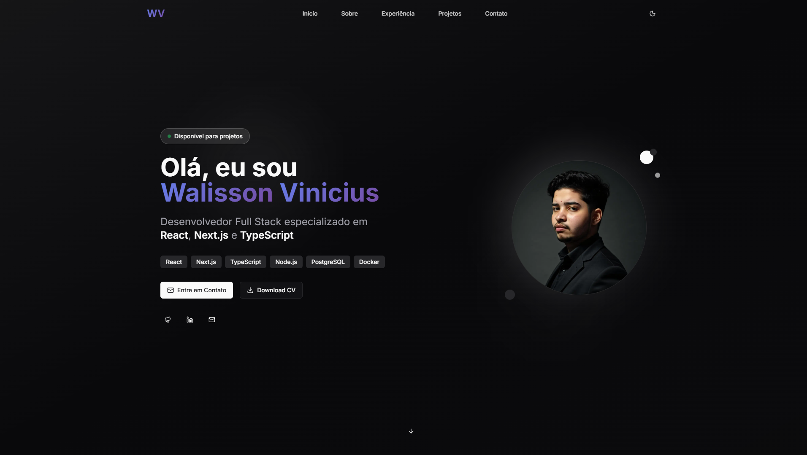

# 🚀 Portfólio Walisson Vinicius

> Desenvolvedor Full Stack especializado em React, Next.js, TypeScript e Node.js



## 📋 Sobre o Projeto

Portfólio pessoal moderno e responsivo desenvolvido com as mais recentes tecnologias web. Apresenta minha experiência profissional, projetos e habilidades técnicas de forma interativa e visualmente atrativa.

## ✨ Funcionalidades

- 🎨 **Design Moderno**: Interface limpa com glass morphism e gradientes
- 🌙 **Tema Escuro/Claro**: Alternância entre temas com persistência
- 📱 **Totalmente Responsivo**: Otimizado para todos os dispositivos
- ⚡ **Performance Otimizada**: SPA com navegação por âncoras
- 🎭 **Animações Suaves**: Transições e micro-interações com Framer Motion
- 📧 **Formulário de Contato**: Sistema de contato via mailto
- 🔗 **Links Sociais**: Integração com GitHub, LinkedIn e WhatsApp
- 📄 **Download de CV**: Currículo disponível para download
- 🎓 **Formação Acadêmica**: Destaque para ADS (Análise e Desenvolvimento de Sistemas)
- 🧭 **Navegação Fluida**: Scroll suave entre seções com âncoras

## 🛠️ Tecnologias Utilizadas

### Frontend

- **Next.js 15** - Framework React para produção
- **TypeScript** - Tipagem estática para JavaScript
- **Tailwind CSS** - Framework CSS utilitário
- **Framer Motion** - Biblioteca de animações
- **Lucide React** - Ícones SVG modernos
- **React Icons** - Ícones de tecnologias

### Ferramentas de Desenvolvimento

- **ESLint** - Linting de código
- **PostCSS** - Processamento de CSS
- **Radix UI** - Componentes acessíveis

## 🚀 Como Executar

### Pré-requisitos

- Node.js 18+ instalado
- npm ou yarn

### Instalação

```bash
# Clone o repositório
git clone https://github.com/WalissonVinicius/portfolio

# Entre no diretório
cd portfolio

# Instale as dependências
npm install

# Execute em modo de desenvolvimento
npm run dev
```

O projeto estará disponível em `http://localhost:3000`

### Scripts Disponíveis

```bash
npm run dev      # Executa em modo de desenvolvimento
npm run build    # Gera build de produção
npm run start    # Executa build de produção
npm run lint     # Executa linting do código
```

## 📁 Estrutura do Projeto

```
src/
├── app/                 # App Router do Next.js
│   ├── globals.css     # Estilos globais
│   ├── icon.tsx        # Favicon dinâmico
│   ├── layout.tsx      # Layout principal
│   └── page.tsx        # Página única (SPA)
├── components/         # Componentes React
│   ├── ui/            # Componentes de UI base
│   ├── hero-section.tsx        # Seção inicial
│   ├── about-section.tsx       # Sobre + Formação
│   ├── experience-section.tsx  # Experiências
│   ├── projects-section.tsx    # Projetos
│   ├── contact-section.tsx     # Contato
│   ├── navigation.tsx          # Navegação por âncoras
│   └── tech-icons.tsx          # Ícones de tecnologias
└── data/
    └── profile.json    # Dados do perfil
```

## 🎨 Seções do Portfólio

### 🏠 Hero Section (#home)
- Apresentação pessoal
- Skills principais (6 tecnologias core)
- Links para redes sociais funcionais
- Botão de download do CV
- Elementos visuais animados

### 👨‍💻 Sobre Mim (#about)
- Biografia profissional
- **Formação Acadêmica**: Tecnólogo em ADS
- Stack de tecnologias organizadas por categoria
- Ícones SVG autênticos das tecnologias
- 5 categorias: Frontend, Backend, Database, DevOps, AI

### 💼 Experiência Profissional (#experience)
- Histórico de trabalho atualizado
- Descrição detalhada de cada posição
- Tecnologias utilizadas por empresa
- Principais conquistas e responsabilidades

### 🚀 Projetos (#projects)
- Portfólio de 8 projetos desenvolvidos
- Filtros por tecnologia funcionais
- Imagens de preview dos projetos
- Links para demo e código fonte
- Status "Online" para todos os projetos
- Botão WhatsApp para contato

### 📞 Contato (#contact)
- Formulário de contato funcional (mailto)
- Informações de contato diretas
- Links para redes sociais
- Integração completa com WhatsApp
- Resposta rápida garantida

## 🌟 Destaques Técnicos

- **SEO Otimizado**: Meta tags, Open Graph e Twitter Cards
- **Favicon Dinâmico**: Gerado com Next.js ImageResponse
- **Ícones Autênticos**: Ícones SVG oficiais das tecnologias
- **Performance**: Otimizações de imagem e carregamento
- **Acessibilidade**: Componentes acessíveis com Radix UI
- **TypeScript**: 100% tipado para maior confiabilidade

## 📱 Responsividade

O portfólio é totalmente responsivo e otimizado para:

- 📱 **Mobile**: 320px - 768px
- 📟 **Tablet**: 768px - 1024px
- 💻 **Desktop**: 1024px+
- 🖥️ **Large Desktop**: 1440px+

## 🎯 Próximas Funcionalidades

- [ ] Blog integrado
- [ ] Sistema de comentários
- [ ] Analytics integrado
- [ ] PWA (Progressive Web App)
- [ ] Modo offline
- [ ] Internacionalização (i18n)

## 📄 Licença

Este projeto está sob a licença MIT. Veja o arquivo [LICENSE](LICENSE) para mais detalhes.

## 👨‍💻 Autor

**Walisson Vinicius**

- 🌐 Website: [walisson.dev](https://walisson.dev)
- 💼 LinkedIn: [walisson-vinicius](https://linkedin.com/in/walisson-vinicius-952abb205)
- 🐱 GitHub: [WalissonVinicius](https://github.com/WalissonVinicius)
- 📧 Email: walissonvinicius10654@gmail.com

---

⭐ Se este projeto te ajudou, considere dar uma estrela no repositório!
